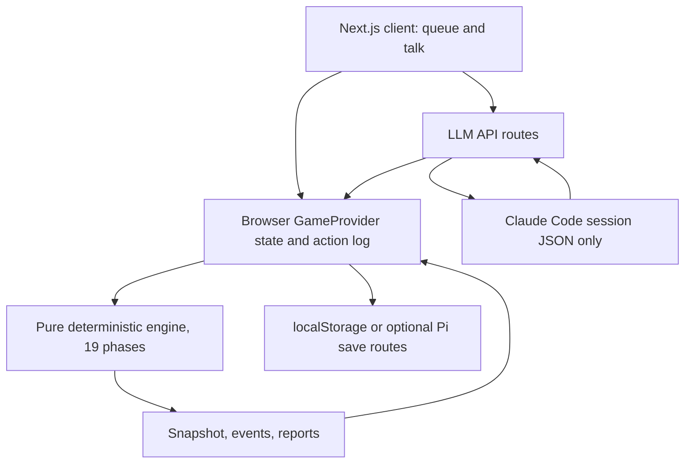
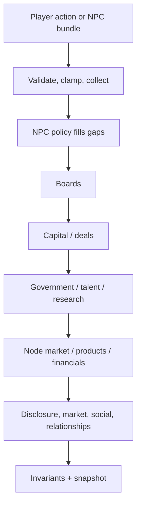
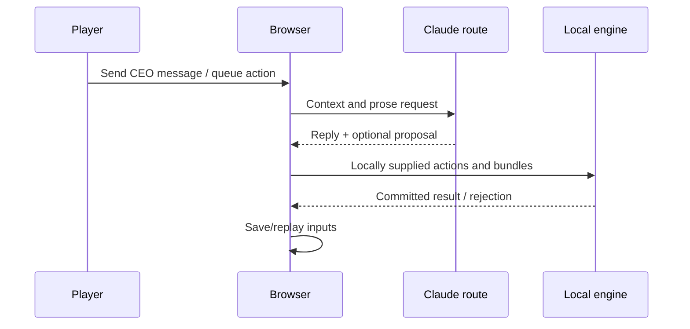
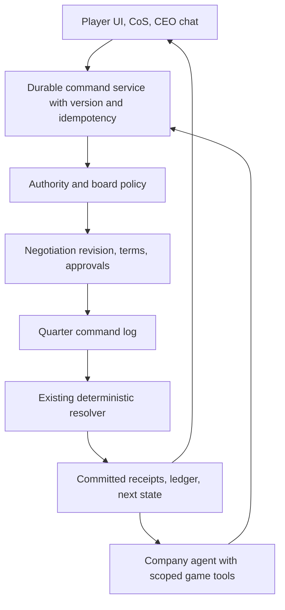

# Company agency and whole-game system audit

**Scope.** This is a source audit of local baseline `9e9c388`, which matches published `dbdd342` at tree `faaa8d19`; it is not a claim about a deployed Pi, Tailscale network, image, Supabase instance, or live Claude Code OAuth session. It maps the full player-to-economy path before proposing further feature work. It does not change production code.

## Executive findings

The simulation core is substantially more real than the CEO purchase conversation makes it appear. `@frontier/simulation` has one deterministic 19-phase resolver, action validation, append-only events, state hashing, replay inputs, and financial-invariant checks. Financing, board gates, research, products, pricing, staff, government bids, ownership and one-off accelerator purchases have materially connected code paths. A model cannot directly mutate the economy.

The break is at the orchestration boundary. The normal game currently resolves in the browser (`apps/web/src/lib/game/provider.tsx`) using the same TypeScript engine the server could use. The browser calls LLM API routes, receives prose/bundles, locally resolves the quarter, and mirrors save data locally or to optional file-backed save routes. There is no authoritative `game/resolve` API that owns the current state, command queue, model turn, and committed result together. Therefore a CEO can sound as though they have agreed to a private deal while no durable executable obligation exists.

The current Claude Code integration is real: a per-company persistent strategist session can return executable typed intents, which the engine validates and resolves. CEO chat remains communication/proposal only, and neither surface shares a durable command/negotiation lifecycle. The current transport intentionally uses text/JSON (`tools: []`, `maxTurns: 1`); that is a present configuration, not a claim that all tools are inherently unsafe. The target is scoped **game tools that stage typed commands**, never shell/filesystem/network tools and never direct state writes.

Two confirmed integrity bugs must be fixed before private supply contracts are expanded:

1. Accelerator seller availability is read independently for every order and is never consumed or reserved. Several buyers can each purchase the same seller's apparent output.
2. A qualifying non-controlling shareholder (at least 5%) can submit `accept_deal` for a company because shareholder-capacity actions bypass the controller/CEO gate; routing then accepts a deal addressed to the company without a second authority check.

These are not evidence that the whole economy is broken. They are priority seam failures: authority, allocation, and durable commitment are exactly the parts a private CEO deal needs.

## What runs today

### State, model, and resolution boundaries

The intended rule in `CLAUDE.md` is sound: only the engine makes reality; LLM output is zod-validated proposal material. The browser additionally revalidates queued actions, then the engine validates them again. `packages/simulation/src/resolver/index.ts` locks the quarter, forks seeded RNG by phase, emits ledger events, checks invariants, commits the ledger, and writes a snapshot. `apps/web/src/lib/game/persistence.ts` rebuilds a save by replaying recorded quarter inputs rather than asking a model again.

The server has LLM and save routes, not a canonical game-session resolver. `apps/web/src/app/api/saves/_shared.ts` explicitly falls back to client `localStorage` when `SAVE_DIR` is unset. This is an implementation/documentation mismatch with the server-authority rule, while respecting `CLAUDE.md`'s explicit demo-mode in-memory exception. Supabase schema and deployment material exist, but this audit found no normal player `POST /api/game/resolve` path that makes a remote database the authority for the displayed session.

### The quarter and command lifecycle

The resolver phase contract is defined in `packages/contracts/src/sim.ts` and executed by `packages/simulation/src/resolver/index.ts`: world events, modifiers, information reveal, action collection, board resolution, capital, government, talent, research, node market, product demand, financials, disclosure, market, social, relationship update, leaderboard update, ledger commit, and snapshot. The authoritative list is `packages/contracts/src/sim.ts` (`RESOLUTION_PHASES`). This gives real handoffs: a board approval can authorize capital in the same quarter; current-quarter financials precede disclosure/market effects; social posts affect later belief. The UI says “eighteen phases” while `RESOLUTION_PHASES` declares nineteen: a confirmed UI-copy defect, not a resolution defect.

The present command lifecycle is weaker than it looks:

CEO talk is a communication call (`company-dialogue/route.ts`), not a transaction service. A one-off accelerator action is mechanically real when it reaches `buy_accelerators`, but the chat bridge does not establish a private recurring allocation, board decision, seller reservation, or counterparty-authorized contract. The reply in the reported screenshot correctly says a formal decision is needed; the product then fails to provide a complete path for it.

## Companion inventory

This report maps journeys and their handoffs. The companion [action capability inventory](./action-capability-inventory.md) is the exact ActionIntent-by-ActionIntent validator, authority, routing, settlement and surface index; read both before declaring an action available.

## Capability matrix

Statuses mean **implemented** (an end-to-end deterministic settlement path exists in source), **partial** (a usable piece exists but an essential authority/lifecycle/journey link is absent), **unsupported** (no executor for the promised activity), or **unverified** (not proven in a live build even if code exists).

| Major journey | Status | What is confirmed | Essential gap / source |
|---|---|---|---|
| CEO private conversation | Partial | Per-company Claude dialogue sessions, bounded context and conversation persistence. | Prose does not create a durable negotiation revision or commitment. `apps/web/src/app/api/llm/company-dialogue/route.ts`, `packages/llm/src/transport/claudeSession.ts` |
| One-off accelerator purchase | Implemented, integrity bug | `buy_accelerators` validates price/seller and books buyer cash/PPE; `pendingAcceleratorPurchases` is an accounting staging record cleared in financial resolution, not a future delivery guarantee. | Seller capacity is not decremented/reserved, so orders can overbook. `packages/simulation/src/companies/compute.ts`, `packages/simulation/src/companies/sellers.ts` |
| Recurring “100/quarter, spot + 5%, priority” supply | Unsupported | Supply terms and supplier choice exist for product inputs. | No recurring-compute executor; no reservation ledger, allocation or priority queue. `packages/contracts/src/actions.ts`, `packages/contracts/src/deals.ts`, `packages/simulation/src/companies/supply.ts` |
| Generic private deals | Partial | Deals can be proposed/accepted/rejected; some cash and node-licence variants settle. | Generic binding settlement deliberately rejects many obligation mixes; no complete private performance-contract executor. `packages/simulation/src/resolver/routing.ts`, `packages/contracts/src/deals.ts` |
| Board approval | Implemented | CEO actions can become board matters; vote precedes capital settlement. | Future performance supply contracts have no materiality/board model yet. `packages/simulation/src/validator/boardMatters.ts`, `packages/simulation/src/boards/*` |
| Debt / equity / IPO / buyback / dividends | Implemented with limits | Board handoff, cash/debt/shares/cap table/ledger/invariant paths are connected. | Debt lacks lender/covenant/restructuring behavior; private `issue_shares` semantics are thin. `packages/simulation/src/resolver/capital.ts`, `packages/simulation/src/companies/debt.ts`, `packages/simulation/src/companies/financials.ts` |
| Ownership and group control | Implemented | Cap tables, controller logic, acquisitions and group projections exist. | **Confirmed authority bug:** a ≥5% non-controller holder can accept a company deal. `packages/simulation/src/validator/index.ts`, `packages/simulation/src/resolver/routing.ts` |
| Research, innovation, experiments | Implemented with bounded freedom | Interpreter → typed proposal → research/experiment → nodes/capabilities; private/public projection exists. | Custom recipes are terminal, bounded compositions; a pure thesis is not automatically a product. `packages/simulation/src/research/innovation.ts`, `packages/simulation/src/research/experiments.ts` |
| Custom products and cross-industry production | Partial | Node market, product launch, slots, supply inputs, quality, demand and financials are connected. | Recipe inputs are intentionally constrained/non-blocking; broad industrial depth needs catalogue expansion. `packages/simulation/src/graph/market.ts`, `packages/simulation/src/graph/production.ts`, `packages/simulation/src/companies/products.ts` |
| Market, pricing, and supply | Implemented with partial contract depth | Per-node market price, demand, product price and supply terms affect production/financials. | Current derived demand has a stated quarter lag; recurring obligations and shared scarce allocation remain absent. `packages/simulation/src/graph/market.ts`, `packages/simulation/src/companies/supply.ts` |
| Personnel and executive/CoS | Partial, confirmed appointment defect | Hiring, layoffs, compensation and people/CoS surfaces map to typed actions and dossiers. | `appoint_executive` loses its named candidate during board conversion; the passed appointment uses the submitting actor instead. CoS also needs the same receipt-backed command protocol as CEO chat. `packages/simulation/src/validator/boardMatters.ts`, `packages/simulation/src/resolver/routing.ts`, `packages/simulation/src/boards/effects.ts`, `packages/contracts/src/llm.ts` |
| Government bids | Implemented | Bid actions, opportunities, award/fulfilment resolution and board thresholds exist. | No live E2E proof on deployed runtime. `packages/simulation/src/government/*`, `packages/simulation/src/resolver/routing.ts` |
| NPC company quarterly agency | Partial | NPC bundles share action validation; defaults sustain pricing, supply, capacity and routine behavior. | Major/model-skipped firms do not reliably create research/launch strategies; client passes bare bundles so request-company binding is ineffective. `packages/simulation/src/companies/npc.ts`, `packages/simulation/src/resolver/actions.ts`, `apps/web/src/lib/game/provider.tsx` |
| Messages, memories, receipts | Partial | Conversation metadata, agent-run records and relationship/memory mechanics exist. | Negotiation terms and action-result receipts are not one durable causal record. `packages/contracts/src/people.ts`, `packages/contracts/src/llm.ts`, `packages/simulation/src/relationships/*` |
| Saves, reload and replay | Implemented locally; server persistence partial | Action-log replay, state hashing and optional save-file endpoint exist. | Live server state/resolve ownership is unverified; browser is the normal authority. `apps/web/src/lib/game/persistence.ts`, `apps/web/src/app/api/saves/*` |
| Pi deployment / live Claude / Tailscale | Unverified | Pi deployment kit and Claude-session transport are present. | No audit evidence of a running image, token, Tailscale access, or real session journey. `deploy/pi/*`, `packages/llm/src/transport/claudeSession.ts` |

The reported local baseline passed typecheck, build and exactly 3,348 tests; this audit did not rerun them. That supports unit, integration and deterministic behavior. It does **not** prove live Claude Code, save/reload in a deployed Pi, cross-company authority, or an entire private-deal player journey.

## Confirmed defects, deliberate choices, and unknowns

**Confirmed defects.** The allocation and minority acceptance bugs above are source-proven. `appoint_executive` has a separate confirmed board-handoff defect: validation knows the requested `characterId` and executive role, but board conversion retains them only in summary text; routing records the submitting actor as proposer, and the `csuite_appointment` effect appoints that proposer. A normal CEO submitting an appointment therefore usually reappoints themselves rather than the named candidate. Intentional shareholder self-reinstatement needs an explicit distinct proposal semantic, not this conflation. The existing board test pins the no-op and the validator test only proves the matter is tabled, illustrating why passing tests do not prove a player journey. `packages/simulation/src/validator/boardMatters.ts`, `packages/simulation/src/resolver/routing.ts`, and `packages/simulation/src/boards/effects.ts` show the loss. The current browser call site sends bare `NpcActionBundle`s although the engine accepts `{ requestedCompanyId, bundle }` specifically to reject a bundle that names a different company; converting a bare bundle treats its claimed company as the requested one. This makes the protection ineffective in the live route (`apps/web/src/lib/game/provider.tsx`, `packages/simulation/src/resolver/actions.ts`). The stale “eighteen phases” label is also confirmed.

**Deliberate choices, not bugs.** The architectural boundary is that an LLM cannot execute arbitrary code or directly mutate state. The current `tools: []` and one-turn JSON transport are a conservative implementation choice; scoped game tools are the target extension. NPC innovation being allowed through the ordinary intent is compatible with a world where NPCs invent; `allowPlayerInnovation` is misleadingly named, but should be renamed/defined rather than silently restricted. Generic deal types that lack a settlement route remain non-binding on purpose. A deterministic fallback runs if an LLM is unavailable.

**Operational uncertainty.** Default configuration now requests all active NPC companies and has an unlimited total quarter budget; each individual request still has a 90-second timeout and calls are collected serially. Do not repeat an old “default four/six strategists” claim. Persistent session keys segregate companies, but this audit cannot prove absence of cross-company leakage in a live Claude service. Neither present tests nor a local build establish Pi resource behavior at all-company scale.

## Target architecture: durable session, commands, negotiations and receipts

Recommend a **Pi-owned game/session command service** that reuses the existing deterministic engine and file-backed persistence initially. This is a recommendation for authority, not a requirement for multiplayer, continuous background play, or an immediate Supabase migration. A single-player offline adapter can implement the same contracts over a local save and engine; its limitation is that it cannot safely host external model/tool turns while disconnected.

A command is not an economic outcome. A staged command has: `sessionId`, `quarter`, actor company/character/role, expected state version, deterministic idempotency key, intent/negotiation revision, authorization evidence, and status. It returns a durable receipt: staged, rejected (with machine reason), requires-board, requires-player-confirmation, settled, partially-filled, deferred, or cancelled. Only a committed resolver result can say money, goods, ownership, or a contract changed. The model's prose must cite this receipt or say it is only proposing terms.

Agents receive only their company projection plus entitled public/counterparty facts. Tool capabilities are a shared server-owned catalogue, for example: inspect authorised company projection; create/revise a nonbinding term sheet; propose supported contract templates; stage own-company routine commands; request a board matter; inspect own committed receipts. A CEO may authorize routine action for its own company within role/board limits. A player confirms their own material commitment according to existing confirmation policy; NPCs do not need a player click to act for their own company. No agent gains shell, files, database, unrestricted HTTP, or arbitrary JavaScript access.

Negotiations should be durable state, not chat inference: immutable revisions, counterparties, visibility, typed term template, expiry, authority required, signatures/acceptance, board stage, allocation reservation, and settlement schedule. Conversation remains useful evidence and memory, but never becomes the contract parser. A CEO reply saying “I support 100/quarter at spot +5%” must either generate a revision whose fields visibly say **non-binding / pending board**, or return a receipt for a submitted/approved contract. It must never imply an allocation without a reservation ID.

## Player experience target

Keep the existing five-tab organisation and provide one actionable conversation surface rather than making the player chase a deal through unrelated screens or discover magic phrases. A conversation should visibly progress through: intent → exact proposed terms → required approval(s) → confirmed scheduled effect → committed receipt/outcome in the same thread. A card can open terms, financial consequences, allocation basis, board record, research dependencies, and ledger evidence on demand; the thread should state its current status without requiring those details to be open.

The same rule applies beyond hardware. A realistic product/market request should resolve to a supported contract or action template with its price, capacity, timing, authority and settlement effects visible. When the requested policy or product cannot yet be executed, the interface must say **proposal only** and explain the missing capability rather than present a confirmation control. Research must distinguish a thesis/capability result, a researchable commercial node, and a launchable product; these are separate current engine outcomes, not different graphics.

## Dependency order

1. **Make authority and approval payloads exact.** Bind every NPC bundle to the company requested by the caller; replace the shareholder acceptance bypass with an explicit authority policy per deal type and board threshold. Carry actor/role/board evidence into routing, not merely an `actorCompanyId`, and preserve the original typed intent target (for example, executive candidate and role) through board approval to its effect.
2. **Establish durable session and command ownership.** Add session versioning, command log, idempotency/retry rules, conflict handling, atomic resolution, and projections. Preserve browser/offline compatibility through an adapter, then make the Pi service the preferred authority.
3. **Define negotiation and approval lifecycle.** Add revisions, term templates, offer/counter/expiry, board submissions, player confirmations, and receipt-linked conversation. Implement cancellation and retry behavior before opening agent tool side effects.
4. **Build shared allocation and settlement primitives.** Model inventory/capacity as a quantity ledger with provisional holds, priority rules, overbooking policy, release/expiry, and delivery settlement. Preserve the existing “refuse vs realise” cash policy: a hold, payment timing, default, and credit treatment are explicit contract terms, not a universal new cash-rejection rule. Fix one-off accelerator consumption first.
5. **Add recurring obligations on that primitive.** Implement a recurring **owned-accelerator hardware delivery** contract: per-quarter units, a recorded spot-plus-premium formula, allocation priority, title/delivery, invoicing, breach, default and renewal. Keep this distinct from the existing `compute_supply` deal kind, which supplies accelerator capacity/rental rather than physical accelerator ownership (`packages/contracts/src/deals.ts`). Do not encode either in generic chat or a special UI-only bridge.
6. **Publish a capability catalogue.** UI, CoS and agents should discover the same supported action/contract templates across debt, equity, research, products, experiments, supply, pricing, hiring, bids and governance. Unsupported concepts show “proposal only” rather than an actionable button.
7. **Complete autonomous company policy.** Every active company needs a viable deterministic fallback when Claude is absent: research/launch/frontier selection in addition to routine pricing/capacity/supply. Claude remains the intended decision-maker for company strategy and explanations; fallback keeps the world progressing during outage, timeout, or an explicit operator cap.
8. **Feed structured outcomes back into memory and prose.** Per command/action record proposal, schema result, validation result, board outcome, allocation fill, settlement result and causal events. This makes the next agent turn credible after reload/outage.

## Scenario acceptance matrix and release gates

| Scenario | Required evidence before calling it playable |
|---|---|
| CEO private purchase | CEO tool creates nonbinding revision; player reviews terms; correct seller authority/board approval; confirmed contract reserves capacity; next-quarter delivery/payment produces receipt and events. |
| Cross-company authority | Wrong-company NPC bundle is refused; CEO cannot accept buyer/seller obligation outside authority; 5% holder cannot accept an operational deal; permitted shareholder votes remain permitted. |
| Scarcity / overbooking | Two buyers race for one seller; fills/holds obey a documented priority/tie rule; total reservations and deliveries never exceed supply; cancelled/expired holds release exactly once. |
| Multi-quarter spot + 5% supply | Price is recomputed from recorded spot basis each quarter; priority has an explicit allocation effect; cash, inventory/capacity, invoice, delivery, missed supply and renewal all reconcile across reload. |
| Board and revision conflicts | Counteroffer invalidates prior revision; stale client revision gets conflict receipt; board approval applies to exact material terms; changing quantity/price/schedule reopens approval. |
| Executive appointment | A CEO proposal appoints the named candidate into the named role after board approval; a shareholder self-reinstatement uses a separately explicit path; reload/replay preserves the candidate and no-op tests cannot substitute for this journey. |
| Outage, replay and reload | Model outage chooses deterministic policy and logs fallback; a resolved quarter reloads/replays to same hash; duplicate retry does not double-order; stale plan fails against state version instead of silently executing. |
| Research to market across industries | Idea/experiment → research → owned capability/node → product launch → input/capacity demand → market price/COGS/revenue → disclosure/memory, over several quarters and at least one non-AI industry. |
| Finance and governance | Debt/equity/IPO/buyback/dividend path emits exact ledger changes, board authorization and cap-table/financial invariants; unsupported creditor negotiation is honestly labelled. |
| All-company agency | With live model, each NPC receives only its entitled world/private view and can stage valid own-company commands. With model unavailable/capped, every sector still evolves through deterministic policy. |
| Live release | Pi image starts with configured save authority; save/reload works; Claude OAuth health and fallback are observable; all-company sequential calls stay within an explicit operator budget; no assertion is made from mocked-route tests alone. |

Release gates should be layered: deterministic subsystem and replay tests; service integration tests with real command persistence and fault injection; browser E2E journeys against the service; then a controlled live test-save smoke run using a Claude Code session. A UI action is only labelled **Confirm**, **Reserved**, **Accepted**, or **Delivered** when the matching command/contract/settlement receipt exists. It is labelled **Draft**, **Non-binding**, **Pending board**, **Unavailable**, or **Proposal only** otherwise.

That sequence preserves the existing engine’s strongest property: repeatable economics with a ledger. It changes the missing layer so the company agent is genuinely actionable within game rules and a player can tell exactly what will happen next quarter.
